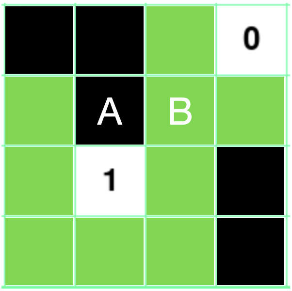

# AI Minesweeper

## Introduction

AI Minesweeper is the classic computer puzzle game that challenges players to detect hidden mines on a grid while avoiding detonating any of them. Traditionally played by human players, AI Minesweeper takes this engaging game to a new level by introducing an artificial intelligence system as the sole player.

In the game of Minesweeper, a certain number of mines are randomly hidden in the grid. The objective is to reveal all the safe cells without triggering any mines. Players click on individual cells, and each revealed cell provides a clue in the form of a number, indicating how many adjacent cells contain mines. Armed with this information, players must use logic and deduction to pinpoint the locations of the mines and strategically clear the board.

<div align="center">
    
</div>

## Description

AI Minesweeper uses logic, deduction, and decision-making in order to solve the puzzle. The AI's primary goal is to reveal all the safe cells without detonating any mines. In this particular game, the grid has 100 cells (10x10), and 10 of those cells contain hidden mines. The AI starts the game by picking random cells and once it has gathered some information from the chosen cells it starts to use logic in order to deduce which uncovered cells are safe and which are mines. The AI uncovers the safe cells and marks with a red flag any deduced mines in order to leave them untouched and thus avoid detonating them.

The game's outcome is simple: If the AI uncovers all 90 safe cells without detonating any mine it wins the game. Otherwise, it loses.

To play the game, the user simply has to select the "Solve the puzzle with AI" button and let the AI do the task! After the game finishes, the user can select the "Play Again" button to play again.

<div align="center">
    
</div>

<div align="center">
    
</div>

## Graphical User Interface (GUI)

Because Minesweeper is a simple game, the tools available in the Pygame library were enough to make this game's GUI. However, there are more sophisticated options available to make a better looking GUI such as Tkinter or PyQT5!

## AI logic

In the game, the AI has two options to select a cell to uncover. The first option is to choose a random cell that has not been uncovered and that is not a deduced mine; the second option is to choose from a set of cells that is known as "safe cells". "Safe cells" contains all the cells that the AI deduced are not mines. In order to make such a deduction, the AI uses logic with the information that it is given. Therefore, if the "safe cells" set has any cells in it, the AI selects a cell from it, but if the "safe cells" set is empty the AI selects a random cell.

In the very beginning of the game, the AI has no information of the board and thus must choose a random cell. Since there are 10 mines in all 100 cells, the probability that the selected random cell is safe is 90%. If the cell indeed is safe the game continues, but if it is a mine the AI loses. After uncovering the first cell the AI can or cannot make deductions; everything depends on the number that appears in the cell (which represents the amount of mines that are surrouding it). If the number is a 0, the AI can use logic to deduce that all cells surrounding that particular cell are safe; if the number is greater than 0 it means that there are mines surrounding it and the AI cannot make any safe deductions from it for now. 

Everytime that the AI uncovers cells, it uses the new information that it obtains with the previous ones that it already has to see if it can make any deductions. For example, in the image below let's say that the green squares represent cells that the AI already safely deduced that are safe. Since the uncovered cell says 1, it means that either A or B is a mine, but the AI cannot make any safe deductions yet because it does not know for sure which is the mine from those two cells.

<div align="center">
    
</div>

The AI makes another move that results in the following board portion:

<div align="center">
    
</div>

The uncovered cell on the top right corner says 0, so that means that all the cells around it can be safely deduced to be "safe cells". Here is where the AI can make an additional deductions. Since it already knew that either A or B is a mine, and now it knows that B is safe, the AI deduces that A is the mine and marks is as a flag.

<div align="center">
    
</div>

A class called "Knowledgebase" was created in the "ai.py" file to pass the information to the AI after every movement. The knowledgebase class contains two attributes, being the set of adjacent cells represented by (x,y) and the mine count that represents how many mines are surrounding it. Everytime that the AI makes a move a new variable called "new_knowledge" is created that is an instance of the "Knowledgebase" class that contains the information of the adjacent cells and count. Once created, the cells in adjacent cells in the "new_knowledge" are analyzed to see if any of them are deduced mines, deduced safes, or have already been uncovered (which still means that are safe). In case that a cell is a deduced mine, the cell is removed and the count is reduced by 1; in case that the cell is a deduced safe or has already been uncovered, the cell is removed. 

Afterwards, the "new_knowledgebase" is added to the main "knowledgebase" list (different from the Knowledgebase class). Then the last uncovered cell is removed from all the knowledge in "knowledegebase". Finally, the knowledgebase is analyzed to see if any new mines or safes can be deduced with the updated information. Newly deduced mines and safes are added to a set containing them to be used to deduce information after future movements.

## Clone the project and play the game

To clone the project and play the game, the user can do the following:

1. Clone this repository to the local machine

2. Install the required libraries through the following command:

    ```bash
    pip install -r requirements.txt
    ```
    

3. Run the game by typing the following in the terminal:

    ```bash
    python main.py
    ```


4. Congratulations, you are ready to play the game!

## Credits
 
This project was inspired by Harvard's CS50 AI course on Edx. One of the assignments was to make part of the backend code for an AI Minesweeper game that already had the front end written as well as the guidelines of which functions were missing to make the game work. After completing the task, I decided to make the game from scratch differently according to my personal preference.

## Contributions

This application was made as a personal project and does not accept contributions. However, users can feel free to clone the repository and use or modify it according to their own needs.

## License

This project is under the terms of the [MIT license](https://opensource.org/license/mit/)